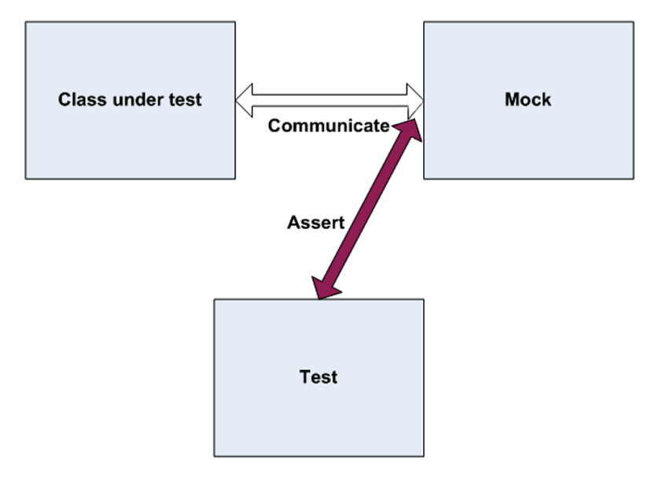
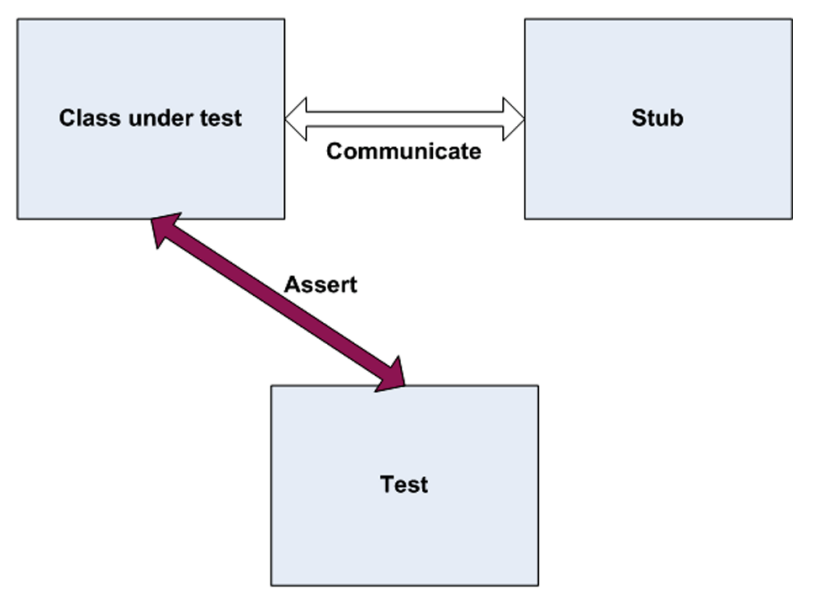

## What are automated tests?

It is a technical application that test your business application. That's it.

## What is a unit test?

It is an **automated piece of code** that invokes a **unit of work** being tested, and checks some assumptions about a **single end result** of that unit.

## What is an unit of work? (demystifying your brain)

*"There are parts of the first edition that today I do not agree with, for example,
that a unit refers to a method...It can be as small as a method, or as big as several classes (possibly assemblies)"* ([Roy Osherove, The Art Of Unit Test](https://www.artofunittesting.com))

*Although I start with the notion of the unit being a class, I often take a bunch of closely related classes and treat them as a single unit. Rarely I might take a subset of methods in a class as a unit.* ([Martin Fowler, Unit Test Article](https://martinfowler.com/bliki/UnitTest.html))

## What is an integration test then?

It is an **automated piece of code** that invokes a unit of work **without having full control over all** of it. Like network servers, time, and so on.

## What are the three types of unit tests?

1. **Return value**. You call a method that return some expected value. This is assertion on the returned value.

2. **State-based**. You call a method that changes the state of the object. This is assertion on the changed value in public property.

3. **Interaction**. You call a method that makes an external call. This is assertion on a fake object method being called correctly.

## What are the types of isolation objects in an unit test?

1. A **fake object** is a generic term to describe either a stub or a mock object.

2. A **mock object** is a fake object in the system that breaks a dependency. It decides whether the test has passed or failed.

3. A **stub object** is a fake object in the stytem that breaks a dependency. It does not decides if the test pass or fail.

## Can stub and mock objects be used together?

