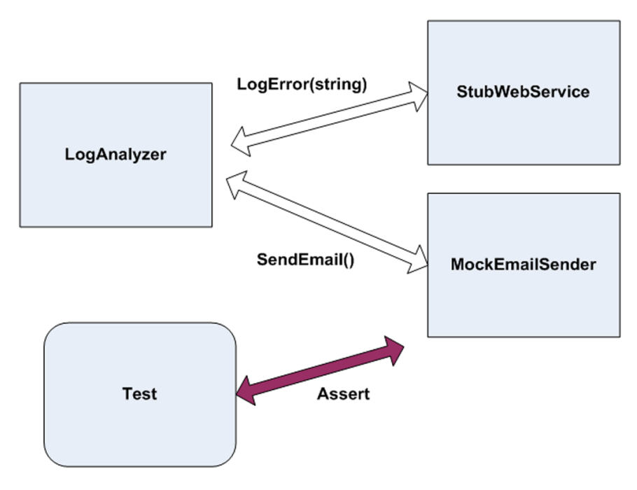

## What is testing?

It is a tool to design your code. Or even your architecture depending on the scope. It is a first citizen thought about the problem to solve.

## What are automated tests?

It is a technical application that test your business application. That's it.

## What is an unit test?

It is an **automated piece of code** that invokes a **unit of work** being tested, and checks some assumptions about a **single end result** of that unit.

## What is an unit of work? (demystifying your brain)

*"There are parts of the first edition that today I do not agree with, for example,
that a unit refers to a method...It can be as small as a method, or as big as several classes (possibly assemblies)"* ([Roy Osherove, The Art Of Unit Test](https://www.artofunittesting.com))

*Although I start with the notion of the unit being a class, I often take a bunch of closely related classes and treat them as a single unit. Rarely I might take a subset of methods in a class as a unit.* ([Martin Fowler, Unit Test Article](https://martinfowler.com/bliki/UnitTest.html))

## What is an integration test then?

It is an **automated piece of code** that invokes a unit of work **without having full control over all** of it. Like network servers, time, and so on.

## What are the three types of unit tests?

1. **Return value**. You call a method that return some expected value. This is assertion on the returned value.

2. **State-based**. You call a method that changes the state of the object. This is assertion on the changed value in public property.

3. **Interaction**. You call a method that makes an external call. This is assertion on a fake object method being called correctly.

## What are the types of isolation objects in an unit test?

1. A **fake object** is a generic term to describe either a stub or a mock object.

2. A **mock object** is a fake object in the system that breaks a dependency. It decides whether the test has passed or failed.

3. A **stub object** is a fake object in the stytem that breaks a dependency. It does not decides if the test pass or fail.

## Can stub and mock objects be used together?

## Do you need convincing to invest in testing?

### 1. Defect Cost Escalation

Defects found in production can cost **25×–100× more** than defects found during requirements, design, or development.

- [The Cost of Finding Bugs Later in the SDLC](https://www.functionize.com/blog/the-cost-of-finding-bugs-later-in-the-sdlc/)
- [Why Fixing Bugs Later Costs More (IBM Systems Sciences Institute)](https://www.functionize.com/blog/the-cost-of-finding-bugs-later-in-the-sdlc/)
- [Software Defect Reduction Top 10 List (NIST)](https://www.nist.gov/system/files/documents/director/planning/report02-3.pdf)
- [The True Cost of Bugs in Software Development](https://www.it-cisq.org/the-cost-of-poor-software-quality/)
- [Flatten the Curve: Balancing Cost, Quality, and Speed](https://smartbear.com/blog/qa-revolution-flatten-the-curve-and-balance-cost-quality-and-speed/)

### 2. Development Velocity vs Testing

Testing improves **feedback speed, confidence, and flow**, reducing rework and interruptions that slow teams down over time.

- [Why Testing Is a Long-Term Investment for Software Engineers](https://dzone.com/articles/invest-in-testing-software-engineers)
- [How to Maintain Software Development Velocity Without Sacrificing Quality](https://fullscale.io/blog/maintain-software-development-velocity/)
- [Velocity-over-Quality Mindset Leads to Software Testing Gaps](https://www.techtarget.com/searchsoftwarequality/news/252523539/Velocity-over-quality-mindset-leads-to-software-testing-gaps)
- [Shift Left to Make Testing Faster Without Impacting Quality](https://www.telerik.com/blogs/shift-left-make-testing-faster-without-impacting-quality)
- [Benefits of Automated Testing in Agile](https://www.cisin.com/coffee-break/what-are-the-benefits-of-automated-testing-in-agile.html)

### 3. Brand Damage and Customer Trust

Visible failures in production lead to **loss of trust, negative word-of-mouth, churn, and long-term brand erosion**, which is far more expensive to recover from than preventing issues through testing.

- [The Cost of Poor Software Development Decisions](https://www.designrush.com/agency/software-development/trends/cost-of-poor-software-development-decisions)
- [Top Consequences of Bugs in Software Testing](https://testmetry.com/top-consequences-of-bugs-in-software-testing/)
- [How Defects Influence Customer Satisfaction and Loyalty](https://spc-software.us/defects-influence-on-customer-satisfaction-and-loyalty/)
- [How Bugs Impact Customer Experience, Revenue, and the Bottom Line](https://shftrs.com/articles/the-importance-of-quality-work-how-bugs-impact-customer-experience-revenue-and-the-bottom-line/)
- [How Software Bugs Damage Brand Reputation](https://www.qualitylogic.com/knowledge-center/software-bug-brand-reputation/)

